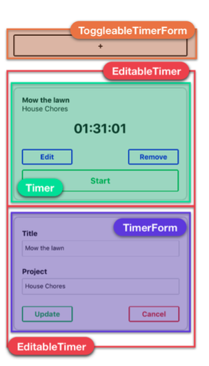

# RN_TimeTracking

## In this basic app, a user can add, delete, and modify various timers.Each timer corresponds to a different task that the user would like to keep time for.

---
### React Fundamentals
+ worked with state and props
+ Data flow between components
+ Handling user inputs
+ Functional components
+ setInterval and clearInterval to run the timer
+ array map anf filter properties
+ KeyboardAvoidingView to focus on textinputs
+ PropTypes to set props type for each components
+ Spread operator ...  to construct new array as a composite of existing arrays.

---

### Application Screens:
### Screen 1.a
<!-- ###  -->

---

### Screen 1.b
<!-- ###  -->

---

### 7 Steps Process
#### 1.Breaking the app into components
##### 

#### 2.Build a static version of the app
#### 3.Determine what should be stateful
#### 4.Determine in which component each piece of state should live
#### 5.Hardcode initial states
#### 6.Add inverse flow
#### 7.Add server communication (if present)

---
### Benifits of Functional Components
#### To create reusable components
#### No need of state management for component